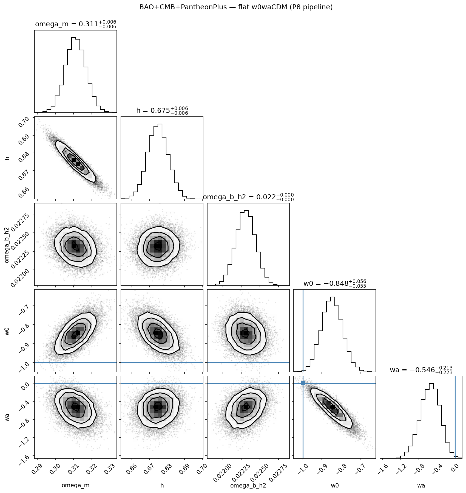
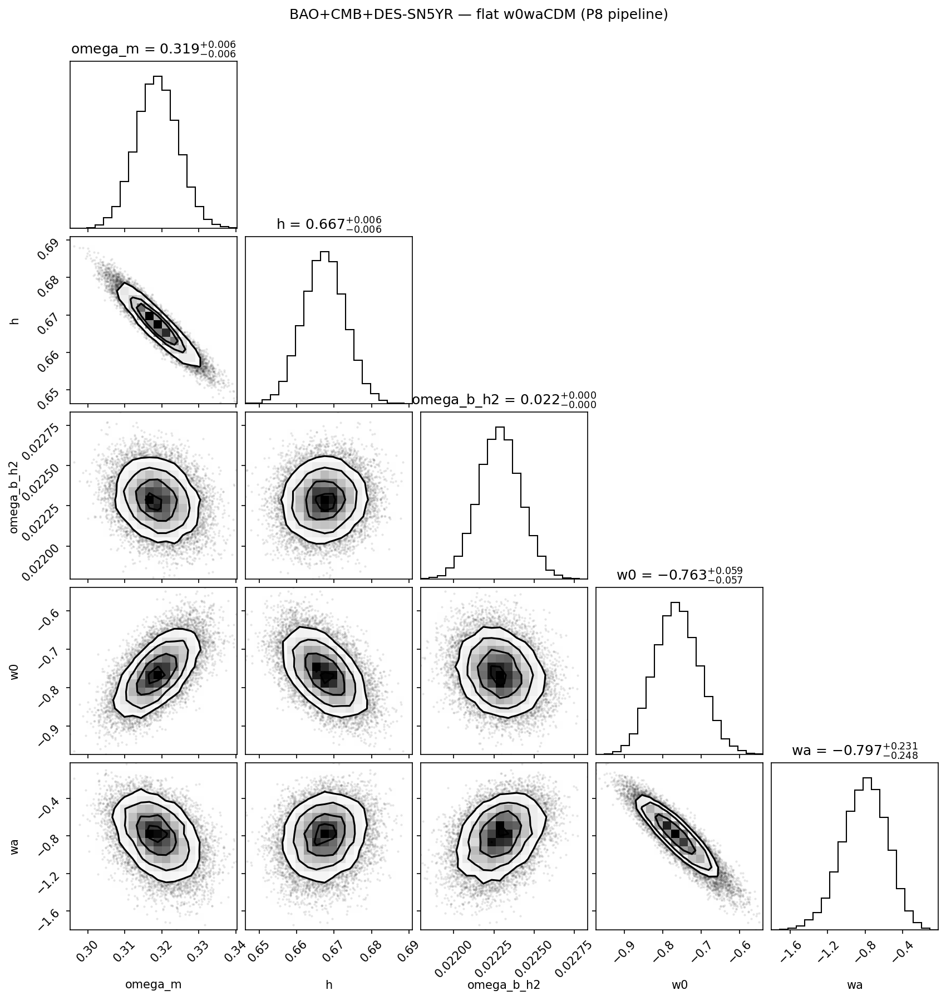

# DESI DR2 dark-energy refit: results and limits

Public report prepared on **2026-10-08**, summarizing analysis release **v1.2.0**. The private implementation snapshot is `dc2d24c8e7ffb6cfa4b2b29800a6b8a3a60ee631`. Preparing this report did not involve rerunning the analysis. The source records are identified in [PROTOCOL.md](PROTOCOL.md).

## Question and scope

How closely does a separate analysis reproduce the DESI DR2 preference for evolving dark energy, and how sensitive is that preference to the supernova data used?

The comparison is between flat ΛCDM and flat CPL w0waCDM, where w(z) = w0 + wa z/(1 + z). ΛCDM is recovered at w0 = −1 and wa = 0. The analysis combines DESI DR2 baryon acoustic oscillations (BAO), a Gaussian compression of cosmic microwave background (CMB) information, and one supernova compilation at a time: Pantheon+, Union3, or DES-SN5YR. It is a reproduction and sensitivity study, not a measurement of a new particle, a negative-mass sector, or a mirror universe.

The statistic is Δχ²_MAP = χ²_CPL − χ²_ΛCDM. Negative values favor CPL in fit quality. The reported Nσ follows the DESI convention: the improvement is mapped through a χ² distribution with two extra parameters to a two-sided Gaussian equivalent. This is a formal convention subject to its statistical assumptions, not a posterior probability that evolving dark energy exists. Significance differences between selections are descriptive; they are not themselves independent statistical tests.

## Baseline reproduction

| Data combination | Δχ²_MAP | Nσ in this analysis | Published reference Nσ |
|---|---:|---:|---:|
| DESI BAO | −4.652 | 1.66 | 1.7 |
| BAO + compressed CMB | −8.023 | 2.36 | 2.4, compressed CMB |
| BAO + compressed CMB + Pantheon+ | −7.574 | 2.28 | 2.8, full CMB |
| BAO + compressed CMB + Union3 | −13.794 | 3.29 | 3.8, full CMB |
| BAO + compressed CMB + original DES-SN5YR | −17.984 | 3.84 | 4.2, full CMB |

The five comparisons and their ordering pass the study's recorded acceptance windows after amendment P8. The supernova rows do not reproduce the full-CMB calculation. Their lower significance is consistent with an effect of compression, but this report does not claim that every difference has been isolated to that cause. The published references are from [DESI DR2 Results II, Tables 5–6 and Appendix A](https://arxiv.org/abs/2503.14738).

**P8 is a material limitation.** The original analytic BAO+CMB calculation produced 1.96σ, outside its predeclared window of 2.1–2.7σ. An audit attributed this discrepancy to approximations in the acoustic-scale calculation. Two multiplicative corrections were then calibrated using the official chains and recorded before the rerun. The initial failure remains part of the record. This amendment was made after seeing the failure: the reproduction is partially calibrated, not wholly blind or independent of the reference analysis. P8 does not use the supernova selections to tune their outcomes.

## Low-redshift sensitivity

All rows below include BAO and compressed CMB. They refer to the original DES-SN5YR release, not Dovekie. Both cosmological models are refitted after each selection.

| Supernova selection | Pantheon+ Nσ | Original DES-SN5YR Nσ |
|---|---:|---:|
| Baseline | 2.279 | 3.837 |
| Require z > 0.1 | 2.014 | 1.464 |
| Remove CfA + CSP; retain Foundation | 2.198 | 3.607 |
| Require z > 0.025 | 2.152 | 3.837 |
| DES survey only | Not applicable | 1.540 |

Removing the low-redshift population weakens the original DES-SN5YR preference much more than the Pantheon+ preference. Removing only CfA and CSP has a smaller effect. Removing data also removes constraining information, so these results do not establish that a survey is faulty or that the cosmological signal is spurious.

## Extensions in analysis v1.1

Three further checks characterize this sensitivity:

1. **Covariance mock check.** The original DES-SN5YR SN-only ΛCDM fit has χ² = 1640.083 for 1829 entries. Among 10,000 Gaussian mock catalogues generated under the stated model and released covariance, five have lower fitted χ². The recorded finite-sample estimate is p = 6.0 × 10⁻⁴. This is a low-tail covariance/model diagnostic, not evidence for CPL. A descriptive exclusion of 75 strongly downweighted entries raises this value to 0.0288, showing sensitivity to the sample definition.
2. **Foundation removal.** Removing Foundation changes the original DES combination from 3.837σ to 2.502σ (−1.335σ), while the corresponding Pantheon+ removal changes its preference by approximately +0.37σ. This locates a difference between the compilations; it does not assign fault to Foundation.
3. **Matched-supernova comparison.** For physical supernovae appearing in both catalogues, the low-redshift versus high-redshift difference in Pantheon+ minus DES distance moduli is −0.0358 mag. Its empirical uncertainty is 0.0080 mag; propagating the two released covariance blocks without their unavailable cross-release covariance gives 0.0334 mag. These quantify different error treatments. The missing joint covariance prevents interpreting the smaller uncertainty as a settled detection significance or choosing a causal explanation.

The catalogue releases overlap in their underlying supernova observations. Their results must not be combined as independent confirmations. The mock check follows the type of covariance diagnostic discussed by [Keeley, Shafieloo and L'Huillier](https://arxiv.org/abs/2212.07917); the matched-catalogue question is discussed by [Efstathiou](https://arxiv.org/abs/2408.07175).

## Extensions in analysis v1.2

**Covariance sensitivity.** Uniformly reducing the supernova covariance according to the SN-only reduced χ² changes the preference by +0.068σ for Pantheon+ and +0.158σ for original DES-SN5YR. An alternative subtraction of a diagonal intrinsic-scatter term changes it by −0.814σ and +0.740σ, respectively. The Pantheon+ subtraction leaves a nearly singular covariance direction and is numerically fragile; it must not be presented as a corrected physical result. All these scenarios are sensitivity tests. The published-covariance baselines remain the reference.

**Dovekie comparison.** Replacing the original DES-SN5YR release with the Dovekie release, while holding the analysis pipeline fixed, gives:

| Quantity | Original DES-SN5YR | Dovekie |
|---|---:|---:|
| Baseline supernova entries | 1829 | 1820 |
| Baseline Nσ | 3.837 | 2.838 |
| Baseline Δχ²_MAP | −17.984 | −10.790 |
| Nσ after removing Foundation | 2.502 | 2.155 |
| Change from removing Foundation | −1.335σ | −0.683σ |
| Change from removing CfA + CSP | −0.230σ | −0.471σ |

The baseline changes by approximately −1.0σ. Foundation's influence is reduced but persists. Dovekie changes several aspects of the data processing and covariance, so this comparison does not identify which change causes the result. The [DES reanalysis](https://arxiv.org/abs/2511.07517) reports a full-CMB change from 4.2σ to 3.2σ; those are literature references, not this project's full-CMB measurements.

## What remains unresolved

- The analysis does not distinguish genuine dark-energy evolution from supernova systematics and does not independently refit photometric calibrations.
- CMB compression and the post-failure P8 calibration limit the independence and scope of the reproduction. Applying this compressed constraint to a different theory would require checking its validity in that theory.
- Union3 is used as a compressed spline product, not a per-supernova likelihood; the per-survey removal tests are not available for that branch. See [Kim's examination of the Union3 product](https://arxiv.org/abs/2412.14181).
- The cross-release covariance of matched supernovae is unavailable. The Dovekie release also supplies its inverse covariance in finite precision, which the analysis inherits.
- The Dovekie subgroup labels inherit the earlier survey mapping; that mapping was not independently reconfirmed in the Dovekie documentation. Subgroup interpretations retain this qualification.
- The report establishes neither Janus nor its proposed hidden sector. It contains no test of antimatter gravity, an accessible parallel universe, or faster travel.

The supported conclusion is specific: the recorded pipeline reproduces reference preferences within its declared windows after a disclosed calibration, and quantifies how those preferences change under selected data and covariance variations.

## Archived baseline posterior figures

These M6 figures show the original DR2-era baseline analysis with the compressed CMB and P8 calibration. They are archived posterior summaries, not Dovekie results. The contours use a different statistical construction from the formal Nσ values in the tables; visual separation from ΛCDM should not be read as an interchangeable significance measurement.

*BAO + compressed CMB + Pantheon+, original M6 baseline. This is the baseline retained in analysis release v1.2.0, not a new fit made for this public report.*

*BAO + compressed CMB + DES-SN5YR tag v1.2, original M6 baseline. This figure predates the Dovekie comparison and must not be used to illustrate its 2.838σ result.*

## Access and credits

The implementation, executable workflow, and detailed run records are kept in a separate private repository. Reproduction access can be requested through a [public access-request issue](https://github.com/Flasher1717/desi-w0wa-results/issues/new?title=Code%20access%20request); do not include sensitive information.

Project owner: **Téo Alletz**. Historical AI assistance: **Claude / Anthropic**. Review of the reported findings and public-report preparation: **Codex / OpenAI**. No institutional affiliation, endorsement, or peer review is implied.
